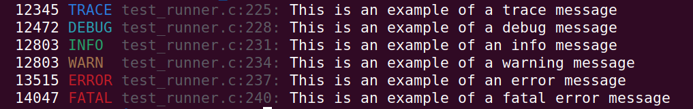

# Logging library for embedded C

A simple logging library for embedded C.

Log messages are written to the console. Optionally, callback functions may be 
registered to perform other logging actions such as writing logs to flash memory 
or publishing logs via a network interface.

By default, the `printf()` function is used to write log messages to the console.
On embedded systems, the `printf()` function is typically configured to print to 
a UART, USB virtual COM port or J-Link RTT channel that can be viewed on an 
attached PC. However, systems that do not support `printf()` can still use the
_log\_ec_ library as described in the section titled 
["Using custom console printing macros"](https://github.com/tonybayley/log_ec#using-custom-console-printing-macros).

Log messages are prefixed with a timestamp, logging level, source code filename
and line number. An example of the log output is shown below:



## Usage
To use the _log\_ec_ library in an existing project, either build and link the library as described in the section 
titled ["Building the log_ec library with CMake"](https://github.com/tonybayley/log_ec#building-the-log_ec-library-with-cmake), 
or just add the two files **[log_ec.c](src/log_ec.c)** and **[log_ec.h](src/log_ec.h)** to the project and compile them 
along with the existing source files. The library provides six function-like macros for logging at six different logging 
levels:

```c
log_trace(const char* fmt, ...);
log_debug(const char* fmt, ...);
log_info(const char* *fmt, ...);
log_warn(const char* fmt, ...);
log_error(const char* fmt, ...);
log_fatal(const char* fmt, ...);
```

Each macro takes a printf format string followed by additional arguments:

```c
log_debug( "Hello %s%c", "worl", 'd' );
```

The macros print the the log message defined by the given format string to the 
console, prefixed with a timestamp, logging level, filename and line number:

```
   21054 DEBUG main.c:11: Hello world
```


## Logging API functions

### log_setLevel( int level )

The logging level is set with the `log_setLevel()` function. `LOG_TRACE` is the
lowest (most detailed) logging level and `LOG_FATAL` is the highest (least 
detailed) logging level. Only log messages at or above the currently set logging 
level are written to the console. By default the logging level is initialised to 
`LOG_TRACE` at boot time, so that log messages at all levels are displayed.


### log_off( void )

By default, logging to the console is enabled at boot time. However, it can be 
disabled by calling `log_off()`. When disabled, the library does not write log 
messages to the console but continues to invoke logging callbacks if any are set.


### log_on( void )

If logging has previously been disabled by calling `log_off()`, it can be 
enabled again by calling `log_on()`.


### log_setTimestampFn( tLog_timestampFn timestampFn )

Configure a function to generate timestamps by calling `log_setTimestampFn()`.
The timestamp function shall return unsigned integer values (uint32_t). The 
time units are user-defined. As an example, the following code-snippet shows how 
to configure timestamps in units of milliseconds on a FreeRTOS based system:

```c
#include "log_ec.h"
#include "FreeRTOS.h"

static uint32_t getTimestamp( void )
{
    TickType_t time = pdTICKS_TO_MS( xTaskGetTickCount() );
    return (uint32_t)time;
}

int main(void)
{
    /* initialise system clocks and hardware */
    ...
    log_setTimestampFn( getTimestamp );  // called once only at boot-time, to register the timestamp function
```


### log_registerCallbackFn( tLog_callbackFn cbFn, void* cbData, int cbLogLevel )

If the preprocessor macro `LOG_MAX_CALLBACKS` is set to a non-zero positive 
integer, then up to `LOG_MAX_CALLBACKS` logging callback functions can be 
registered by calling the `log_registerCallbackFn()` function. The function 
parameters are:

- **cbFn**: Logging callback function pointer.
- **cbData**: Pointer to user data, if required, or NULL if the callback does not require user data.
- **cbLogLevel**: Lowest logging level at which the callback will be invoked.

The registered callback function will be invoked when a log message is written 
at a log level equal to or greater than `cbLogLevel`. Callback functions shall 
implement the `tLog_callbackFn` function signature.

Logging callback functions enable target-specific logging features to be
implemented, such as writing error logs to a flash filesystem, or publishing
log messages via an MQTT broker.


### log_unregisterCallbackFn( tLog_callbackFn cbFn, void* cbData )

Unregister a previously-registered logging callback function and callback data.

The same callback function may have been registered multiple times, with 
different callback data objects. If that is the case, then only the callback 
function instance with matching callback data will be unregistered. After 
unregistering a callback function, that function will no longer be invoked when 
log messages are written.


### log_setLockFn( tLog_lockFn lockFn, void* lockData )

If log messages are written from multiple threads or RTOS tasks, the user can
supply a lock function to prevent the messages becoming interleaved. The lock
function is configured by calling `log_setLockFn()`, with the lock function 
pointer as parameter `lockFn`. Optionally, a user data object (e.g. a mutex 
handle) may be specified via parameter `lockData`. The lock function shall 
implement the `tLog_lockFn` function signature.

The user-supplied lock function is called with `lock=true` to acquire a mutex 
before writing log messages to the console, and is called again with `lock=false`
to release the mutex when log writing is complete.

If the log is written from ISR context (Interrupt Service Routines), then the 
logging system cannot wait to acquire the mutex because ISRs must be 
non-blocking. To achieve this, when the lock function is called from ISR context 
and a task already has ownership of the mutex, the lock function shall return 
immediately with value `false` to indicate that the mutex has not been acquired. 
When the lock function is called from RTOS task context and another task already 
has ownership of the mutex, the task blocks until the mutex can be acquired. 
Therefore, log messages written from a task may be delayed, but are guaranteed 
to be displayed. By contrast, log messages written from ISR context may be 
discarded if the mutex cannot be acquired.

The following code snippet shows how to configure a lock function on a FreeRTOS
based system. In this example, the target is an ARM Cortex-M processor whose 
FreeRTOS port implements the macro `xPortIsInsideInterrupt()`. This macro can 
determine whether the system is in ISR or Task context, so that the appropriate 
context-specific lock behaviour can be implemented.

```c
#include "log_ec.h"
#include "FreeRTOS.h"

static SemaphoreHandle_t logMutex;

/**
 * @brief Log lock function.
 * 
 * @param lock true to acquire the mutex that enables printing of log messages, false to release the mutex.
 * @param lockData Pointer to application-specific data, if required, or NULL.
 * 
 * @return true if the mutex was successfully acquired or released, or false on failure.
 */
static bool logLockFunction( bool lock, void* lockData )
{
    (void) lockData;  // not used
    bool success = false;
    if( logMutex != NULL )
    {
        if( pdTRUE == xPortIsInsideInterrupt() )
        {
            /* FreeRTOS is in ISR context */
            if( lock )
            {
                success = ( pdTRUE == xSemaphoreTakeFromISR( logMutex, NULL ) );
            }
            else
            {
                success = ( pdTRUE == xSemaphoreGiveFromISR( logMutex, NULL ) );
            }           
        }
        else
        {
            /* FreeRTOS is in TASK context*/
            if( lock )
            {
                success = ( pdTRUE == xSemaphoreTake( logMutex, portMAX_DELAY ) );
            }
            else
            {
                success = ( pdTRUE == xSemaphoreGive( logMutex ) );
            }
        }
    }
    return success;
}

int main( void )
{
    /* initialise system clocks and hardware */
    ...
    logMutex = xSemaphoreCreateMutex();
    if( NULL == logMutex )
    {
        log_fatal( "Failed to create logMutex\n" );
        Error_Handler();
    }
    log_setLockFn( logLockFunction, NULL );
```


## Compile time options

### Color

If the library is compiled with preprocessor macro `LOG_USE_COLOR` set to 1, 
ANSI color escape codes will be used when printing. If the macro is set to 0, or
is undefined, then monochrome printing will be used.

If you are building with CMake, then setting the `LOG_USE_COLOR` CMake cache 
variable to "1" or "0" causes that value to be assigned to the `LOG_USE_COLOR` 
preprocessor macro.

### Logging callback functions

If the library is compiled with preprocessor macro `LOG_MAX_CALLBACKS` set to a
non-zero positive integer, then user-defined logging callback functions are 
supported and any number of callback functions between 1 and `LOG_MAX_CALLBACKS` 
may be registered by calling `log_add_callback_func()`. If the `LOG_MAX_CALLBACKS`
macro is set to 0, or is undefined, then user-defined logging callback functions 
are not supported.

If you are building with CMake, then setting the `LOG_MAX_CALLBACKS` CMake cache 
variable to a positive integer string value causes the same value to be assigned
to the `LOG_MAX_CALLBACKS` preprocessor macro.

### Using custom console printing macros

By default, log messages are printed to the console using the C standard library
functions `printf()` and `vprintf()`. However, these functions can be substituted
by user defined functions, to enable resource-constrained embedded systems that
do not implement `printf()` to write log messages using custom functions that 
write directly to a UART, etc.

To override the standard library functions `printf()` and `vprintf()` with 
user-defined functions, define the macro `OVERRIDE_PRINTF` within the build 
system. Then define the macros `CONSOLE_PRINTF()` and `CONSOLE_VPRINTF()` in the 
header file _console\_printf.h_. The `CONSOLE_PRINTF()` and `CONSOLE_VPRINTF()`
macros will be used instead of `printf()` and `vprintf()` respectively.

To see an example, take a look at the unit test application in this git 
repository. `printf()` and `vprintf()` are overridden by user-defined functions 
`testPrintf()` and `testVprintf()` that write log messages to a buffer. That 
enables the test runner to inspect the log messages to verify that they contain 
the expected text. The macro `OVERRIDE_PRINTF` is defined by the CMake build 
system in [CMakeLists.txt](https://github.com/tonybayley/log_ec/blob/main/CMakeLists.txt#L30).
The macros `CONSOLE_PRINTF()` and `CONSOLE_VPRINTF()` are define in the header 
file [test/console_printf.h](https://github.com/tonybayley/log_ec/blob/main/test/console_printf.h#L39-L55).


## Building the log_ec library with CMake

This git repository contains a [**CMakeLists.txt**](./CMakeLists.txt) file that
builds _log\_ec_ as a static library. To include the _log\_ec_ logging library 
in another application, add the following code snippet to that application's
top-level _CMakeLists.txt_ file:

```cmake
FetchContent_Declare(log_ec
    GIT_REPOSITORY  https://github.com/tonybayley/log_ec.git
    GIT_TAG         main
    SOURCE_DIR      ${CMAKE_CURRENT_LIST_DIR}/log_ec
)

FetchContent_MakeAvailable( log_ec )

# Add linked libraries
target_link_libraries(${CMAKE_PROJECT_NAME}
    log_ec
)
```


## Unit tests

The tools required to build and run the unit on a Linux host are GCC compiler, 
CMake and GCOVR, which can be installed with the command:

```bash
sudo apt install build-essential cmake gcovr
```

Unit tests are implemented in the file [**test/test_runner.c**](test/test_runner.c).
The tests are built and run using the following commands in the root directory.

```bash
rm -rf build
cmake -B build -DLOG_MAX_CALLBACKS=2
cmake --build build
ctest --test-dir build
```

To view a detailed HTML test coverage report, open the file 
[**build/test/coverage.html**](./build/test/coverage.html) in a web browser.


## License

This library is free software; you can redistribute it and/or modify it under
the terms of the MIT license. See [LICENSE](LICENSE) for details.
